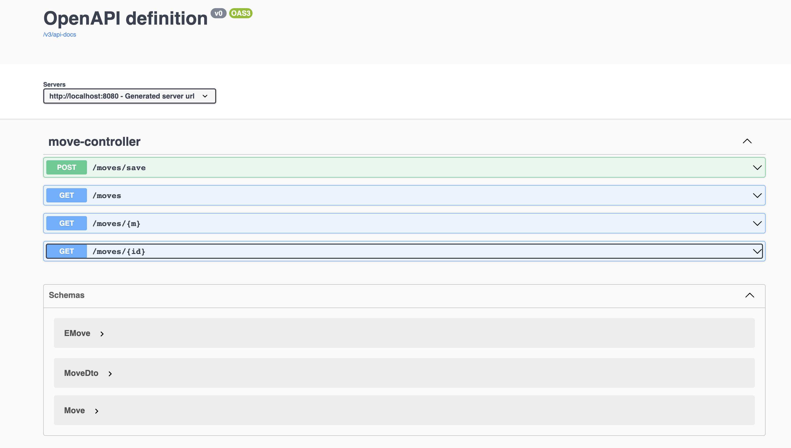

# Chegura Back End Service
Back end service for chess moves tracking

## Open API documentation
- Open 'http://{server}:{port}/api-docs' to view documentation in JSON format
```bash
http://localhost:8080/v3/api-docs
```
- Open 'http://{server}:{port}/swagger-ui.html' to view documentation
```bash
http://localhost:8080/swagger-ui/index.html
```

<p align="left">
    
</p>

## Service set up
```bash
./gradlew clean build bootRun
```

## Architecture
Using https://adr.github.io/, so you can find decisions in __docs__ folder