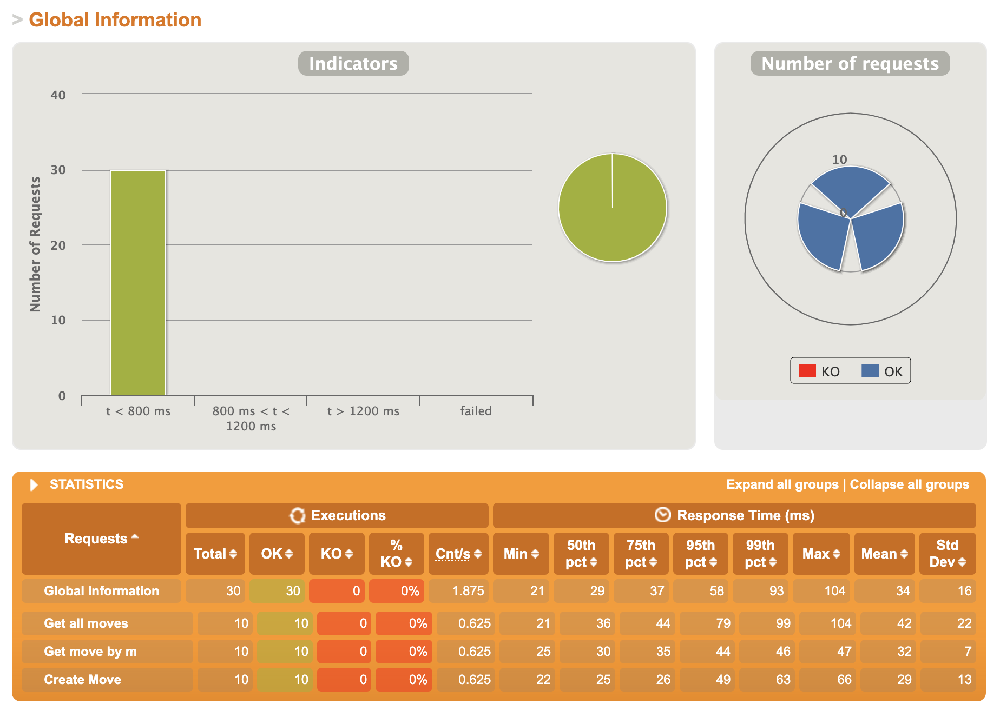

# Performance test results 
* Status: __SUBMITTED__
* Date: 21-03-2021

## PROBLEM
- Need to execute performance test to verify that service fits SLA

## SLA
- Existent data can be provided in <1 sec.
- Service should handle 10K RPM
## PERFORMANCE TEST SCENARIO
- Get all moves
- Get particular move
- Create move

## RESULTS (Executed on local workstation, so it's not optimal)

    

